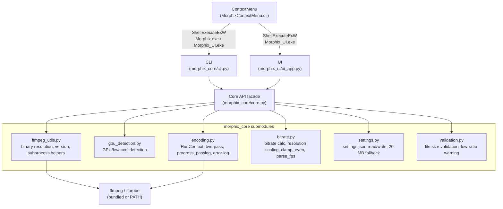

# Design Document: Morphix Video Compressor

## Overview

Morphix is a Windows desktop video compression application that wraps ffmpeg to compress video files to a user-specified maximum size in megabytes. It uses two-pass H.264 (libx264) encoding with configurable audio codec and bitrate, automatic resolution scaling based on bits-per-pixel quality thresholds, and optional GPU-accelerated decoding.

The application is structured as three distinct entry points sharing a common core:

- **CLI** (`morphix_core/cli.py`, `morphix_core/cli_args.py`): terminal-based interface for scripting and automation
- **UI** (`morphix_ui/ui_app.py`): Tkinter desktop GUI for non-technical users, including a settings panel for configuring the default context menu compression size
- **ContextMenu** (`ContextMenuWrl/`): Windows COM shell extension for right-click integration in Explorer

All three entry points delegate to the same `morphix_core/core.py` compression engine, which orchestrates ffprobe metadata extraction, bitrate calculation, resolution scaling, and two-pass ffmpeg encoding.

The application is packaged as an MSIX installer that bundles the CLI EXE, UI EXE, and ContextMenu DLL.



---

## Architecture

### Layered Design

```
┌──────────────────────────────────────────────────────────┐
│                     Entry Points                         │
│   CLI (argparse)  │  Tkinter UI  │  COM ContextMenu DLL  │
└──────────────────────────────────────────────────────────┘
                          │
                          ▼
┌──────────────────────────────────────────────────────────┐
│          morphix_core/core.py  (public API facade)       │
│  re-exports from submodules; no logic of its own         │
└──────────────────────────────────────────────────────────┘
          │          │          │          │          │
          ▼          ▼          ▼          ▼          ▼
┌──────────────────────────────────────────────────────────┐
│                  morphix_core submodules                 │
│  ffmpeg_utils │ gpu_detection │ encoding │ bitrate       │
│  settings     │ validation                               │
└──────────────────────────────────────────────────────────┘
                          │
                          ▼
┌──────────────────────────────────────────────────────────┐
│              ffmpeg / ffprobe binaries                   │
│         (bundled in MSIX or resolved from PATH)          │
└──────────────────────────────────────────────────────────┘
```

### Key Design Decisions

1. **`RunContext` class**: All per-run state is encapsulated in a `RunContext` object. This avoids global state and makes the core testable in isolation.
2. **Subprocess-based ffmpeg invocation**: ffmpeg is invoked via `subprocess.Popen` rather than the `ffmpeg-python` stream API's `.run()` method, so that progress can be parsed from stderr in real time and console windows can be suppressed on Windows.
3. **Two-pass encoding**: Pass1 generates bitrate statistics; Pass2 uses them to produce the final output. Passlog files are written to a `.output/` subdirectory and cleaned up after Pass2.
4. **Bundled binary resolution**: The application searches for ffmpeg/ffprobe in PyInstaller's `_MEIPASS`, next to the Python executable, and in a relative `ffmpeg/` directory before falling back to PATH.
5. **COM shell extension**: The ContextMenu is a 64-bit WRL-based COM DLL that implements `IExplorerCommand`. It launches the Python-built EXEs via `ShellExecuteExW` to avoid blocking Explorer.

---

## Components and Interfaces

### 1. `morphix_core/core.py` — Public API Facade

`core.py` is the stable public API surface for all callers (`cli.py`, `ui_app.py`, ContextMenu). It contains no logic of its own; it re-exports every public symbol from the submodules below so that existing import paths remain unchanged.

```python
# morphix_core/core.py (conceptual)
from morphix_core.ffmpeg_utils import find_ffmpeg_binaries, get_ffmpeg_version, popen_no_window_kwargs, ffprobe_media
from morphix_core.gpu_detection import detect_cuda, get_available_devices, resolve_device_info
from morphix_core.encoding import RunContext
from morphix_core.bitrate import target_kbps_for_size_mb, compute_scaled_resolution, clamp_even, parse_fps
from morphix_core.settings import read_settings, write_settings
from morphix_core.validation import check_target_exceeds_file_size, check_low_compression_ratio

def run(input_path, max_mb, output_path=None, quality="medium", resolution=None,
        overwrite=True, disable_logs=True, progress=True, progress_cb=None) -> str:
    ctx = RunContext(...)
    return ctx.execute()
```

### 1a. `morphix_core/ffmpeg_utils.py`

Binary resolution, version detection, and subprocess helpers.

| Function | Responsibility |
|---|---|
| `find_ffmpeg_binaries()` | Locate ffmpeg/ffprobe in `_MEIPASS`, next to Python exe, `ffmpeg/` subdir, then PATH; return `(ffmpeg_path, ffprobe_path, source)` |
| `get_ffmpeg_version(ffmpeg_path)` | Run `ffmpeg -version` and return the version string (e.g. `"7.1"`) |
| `ffprobe_media(path, ffprobe_path)` | Run ffprobe, return parsed JSON |
| `popen_no_window_kwargs()` | Return OS-appropriate subprocess creation flags |

### 1b. `morphix_core/gpu_detection.py`

All GPU/hardware acceleration detection logic.

| Function | Responsibility |
|---|---|
| `detect_cuda()` | Check for NVIDIA GPU via `nvidia-smi -L` |
| `detect_amd()` | Check for AMD GPU via `rocm-smi` or WMI |
| `detect_intel()` | Check for Intel GPU via WMI or registry |
| `get_available_devices()` | Return all detected devices as `(key, label)` tuples, GPU-first, always ending with `("cpu", "CPU")` |
| `resolve_device_info(device_preference)` | Accept a device key string and return `(label, hwaccel)`; falls back to `("CPU", None)` when unavailable |

### 1c. `morphix_core/encoding.py`

Two-pass encoding orchestration, progress parsing, passlog management, and error logging.

**`RunContext` class** — all per-run state and execution logic:

| Method | Responsibility |
|---|---|
| `execute()` | Top-level orchestration: probe → validate → scale → encode → cleanup |
| `_resolve_output_path()` | Derive default output path from input filename |
| `_probe_media()` | Run ffprobe, extract duration and stream metadata |
| `_configure_hwaccel()` | Detect GPU vendor, set `input_kwargs` |
| `_compute_scaling()` | Decide scale filter (manual override or auto-bpp) |
| `_prepare_logs()` | Create `.output/` dir, set `passlog_path` |
| `_run_ffmpeg(stream, phase)` | Dispatch to progress or simple runner |
| `_run_ffmpeg_with_progress(stream, phase)` | Parse `out_time_ms` from stderr, invoke `progress_cb` |
| `_run_ffmpeg_simple(stream)` | Run without progress parsing |
| `_cleanup_logs()` | Delete passlog files, remove `.output/` if empty |
| `_write_ffmpeg_error(exc)` | Write stderr to `ffmpeg-error.log` |

### 1d. `morphix_core/bitrate.py`

Bitrate calculation, resolution scaling, and related math helpers.

| Function | Responsibility |
|---|---|
| `target_kbps_for_size_mb(size_mb, duration_s, audio_kbps)` | Compute target video bitrate |
| `compute_scaled_resolution(width, height, fps, video_bps, target_bpp, min_height)` | Compute auto-scaled dimensions |
| `clamp_even(value)` | Round to nearest even integer |
| `parse_fps(rate_text)` | Parse ffprobe fps strings |

### 1e. `morphix_core/settings.py`

Reading and writing `%APPDATA%\Morphix\settings.json`, including the fallback-to-20-MB logic.

| Function | Responsibility |
|---|---|
| `read_settings()` | Read `settings.json`; return `{"default_mb": 20}` on any failure |
| `write_settings(default_mb)` | Write `{"default_mb": value}` to `settings.json`, creating dirs as needed |

### 1f. `morphix_core/validation.py`

Input validation logic called before any ffprobe/ffmpeg invocation.

| Function | Signature | Behaviour |
|---|---|---|
| `check_target_exceeds_file_size(target_mb, input_path)` | `(float, str) -> None` | Raises `ValueError` if `target_mb >= os.path.getsize(input_path) / 1_000_000`. Must be called before ffprobe. |
| `check_low_compression_ratio(target_mb, input_path)` | `(float, str) -> bool` | Returns `True` if `target_mb < 0.03 * file_size_mb`, indicating a very high compression ratio. Returns `False` otherwise. |

Both functions read only the OS file size (no ffprobe invocation) and are pure with respect to the encoding pipeline.

### 2. `morphix_core/cli.py` and `morphix_core/cli_args.py`

The CLI entry point. `parse_args()` uses `argparse` to parse command-line arguments and returns a namespace. `main()` calls `run()` with the parsed arguments.

Before invoking `run()`, `main()` calls `check_target_exceeds_file_size` and `check_low_compression_ratio` from `morphix_core.validation`:
- If `target_mb >= file_size_mb`: prints an error message to **stderr** and exits with a non-zero exit code — no ffprobe or ffmpeg is invoked.
- If `target_mb < 3% of file_size_mb`: prints a warning message to **stderr** and continues (non-blocking — no interactive prompt).

**Arguments:**

| Argument | Type | Default | Description |
|---|---|---|---|
| `input` | positional | required | Input video path |
| `--max-mb` | float | required | Target size in MB |
| `--output` | str | None | Output file path |
| `--quality` | choice | `medium` | `low`/`medium`/`high` |
| `--resolution` | str | None | `WIDTHxHEIGHT` override |
| `--overwrite` / `--no-overwrite` | flag | overwrite | Overwrite output |
| `--progress` / `--no-progress` | flag | progress | Show progress |
| `--disable-logs` / `--enable-logs` | flag | disable | ffmpeg log output |
| `--no-console` | flag | off | Re-launch without console window (Windows) |
| `--test` | flag | off | Use hardcoded test defaults |

### 3. `morphix_ui/ui_app.py`

A Tkinter `Tk` subclass (`MorphixUI`) that provides the graphical interface. The module is structured with UI layout/widget construction clearly separated from event handler logic (via comments or extracted helper methods).

**Key behaviors:**
- Accepts an optional positional CLI argument for pre-loading an input file path (used by "Open in Morphix" context menu entry)
- Before starting compression, calls `check_target_exceeds_file_size` and `check_low_compression_ratio` from `morphix_core.validation`:
  - If `target_mb >= file_size_mb`: shows `tkinter.messagebox.showerror` with an explanatory message and aborts — no ffprobe or ffmpeg is invoked.
  - If `target_mb < 3% of file_size_mb`: shows `tkinter.messagebox.askokcancel` warning the user that the compression ratio is very high and output quality will likely be poor, recommending no lower than 5% of the original file size. If the user cancels, compression is aborted silently; if confirmed, compression proceeds normally.
- Runs compression in a `daemon` background thread
- All UI updates from the background thread go through `self.after(0, ...)` for thread safety
- Converts GB to MB before calling `run()` using `size_mb = size_value * 1000`
- Detects device and ffmpeg source at startup and displays them in status labels
- Provides a settings section/window where the user can view and change the default MB value used by the "Compress with Morphix" context menu entry; persists the value to `%APPDATA%\Morphix\settings.json`

**UI controls:**

| Control | Purpose |
|---|---|
| Input file entry + Browse | Select input video |
| Output file entry + Browse | Select output path |
| Target size entry + unit selector (MB/GB) | Enter target size |
| Device dropdown (`OptionMenu`) | Select which device (GPU or CPU) to use; populated by `get_available_devices()`, defaults to first entry, disabled during compression |
| Compress button | Start compression |
| Device status label | Show resolved device label for the current selection |
| FFmpeg status label | Show ffmpeg source and version in the format `FFmpeg: bundled (Version: X.Y.Z)` or `FFmpeg: system PATH (Version: X.Y.Z)` |
| Status label | Show progress / result / error |
| Settings section/window | View and change the default MB value for the "Compress with Morphix" context menu entry; saves to `%APPDATA%\Morphix\settings.json` |

### 4. `ContextMenuWrl/` (C++ COM DLL)

A 64-bit WRL-based COM DLL implementing `IExplorerCommand`. Contains two command implementations:

**`MorphixExplorerCommand`** ("Compress with Morphix"):
- Reads the persisted settings file (`%APPDATA%\Morphix\settings.json`) to obtain the user-configured default MB value; falls back to `20` MB if the file is missing or unreadable
- Silently launches `Morphix.exe` with `--max-mb <value>` and `--output <path>` via `ShellExecuteExW` — no dialog or prompt is shown

**`MorphixOpenCommand`** ("Open in Morphix"):
- Launches `Morphix_UI.exe` with the selected file path as a positional argument via `ShellExecuteExW`

Both commands are registered as separate top-level `IExplorerCommand` entries in the MSIX manifest.

### 5. MSIX Package (`msix/`)

- `AppxManifest.xml`: declares package identity, COM server registration, and file type associations
- `Assets/`: logo images at required sizes (`Square44x44Logo`, `Square150x150Logo`, `StoreLogo`)
- `scripts/build_msix.ps1`: PowerShell build script

---

## Data Models

### `RunContext` State

```python
@dataclass  # conceptual; actual implementation uses __init__
class RunContext:
    # Inputs
    input_path: str          # absolute path to input video
    max_mb: float            # target size in megabytes
    output_path: str | None  # explicit output path, or None for auto-derived
    quality: str             # "low" | "medium" | "high"
    resolution: str | None   # "WIDTHxHEIGHT" or None
    overwrite: bool
    disable_logs: bool
    progress: bool
    progress_cb: Callable[[float, str], None] | None

    # Derived during execution
    input_dir: str           # directory of input_path
    duration: float          # video duration in seconds (from ffprobe)
    video_kbps: int          # computed target video bitrate
    video_bps: int           # video_kbps * 1000
    probe: dict              # raw ffprobe JSON output
    scale_filter: str | None # e.g. "scale=1280:720" or None
    passlog_path: str        # path prefix for two-pass log files
    log_dir: str             # path to .output/ directory
    input_kwargs: dict       # hwaccel kwargs for ffmpeg input (e.g. {"hwaccel": "cuda"})
    device_label: str        # "NVIDIA GPU" | "AMD GPU" | "Intel GPU" | "CPU"
    ffmpeg_path: str         # resolved ffmpeg binary path
    ffprobe_path: str        # resolved ffprobe binary path
    ffmpeg_source: str       # "bundled" | "path"
```

### Bitrate Calculation

```
target_bytes = size_mb × 1,000,000
total_kbps   = (target_bytes × 8) / duration_s / 1000
video_kbps   = max(total_kbps − audio_kbps, 1)
```

### Resolution Scaling

```
current_bpp = video_bps / (fps × width × height)

if current_bpp >= target_bpp:
    no scaling

else:
    target_pixels = video_bps / (fps × target_bpp)
    scale         = sqrt(target_pixels / (width × height))
    new_w         = clamp_even(width × scale)
    new_h         = clamp_even(height × scale)

    if new_h < 480:
        new_h = clamp_even(480)
        new_w = clamp_even(480 × (width / height))

    if new_w < 2 or new_h < 2:
        no scaling
```

BPP thresholds by quality level:

| Quality | BPP Threshold |
|---|---|
| `low` | 0.05 |
| `medium` | 0.07 |
| `high` | 0.10 |

### ffprobe Output (relevant fields)

```json
{
  "format": {
    "duration": "123.456"
  },
  "streams": [
    {
      "codec_type": "video",
      "width": 1920,
      "height": 1080,
      "avg_frame_rate": "30/1",
      "r_frame_rate": "30/1"
    }
  ]
}
```

### Hardware Acceleration Detection

Detection order (first success wins):

| Priority | Vendor | Detection Method | hwaccel value | Label |
|---|---|---|---|---|
| 1 | NVIDIA | `nvidia-smi -L` exits 0 with output | `cuda` | `NVIDIA GPU` |
| 2 | AMD | `rocm-smi` or WMI query | `amf` | `AMD GPU` |
| 3 | Intel | WMI or registry query | `qsv` | `Intel GPU` |
| 4 | CPU | fallback | `None` | `CPU` |

`get_available_devices()` returns all detected devices as a list of `(key, label)` tuples in preferred order (best GPU first), with `("cpu", "CPU")` always included as the last entry. `resolve_device_info(preference)` accepts a device key and resolves it to a `(label, hwaccel)` tuple, falling back to `("CPU", None)` when the requested device is unavailable.

### Output Path Derivation

```
input:  /path/to/video.mp4
size:   15.0 MB
output: /path/to/video_15mb.mp4

input:  /path/to/video (no extension)
output: /path/to/video_15mb.mp4

input:  /path/to/video.mp4
explicit output: /custom/path/out.mp4
output: /custom/path/out.mp4
```

### Passlog Files

```
.output/ffmpeg2pass-0.log
.output/ffmpeg2pass-0.log.mbtree
```

Both are deleted after Pass2 completes. The `.output/` directory is removed if empty.

### Settings File (`%APPDATA%\Morphix\settings.json`)

Stores user-configurable application settings shared between the UI and the ContextMenu DLL.

```json
{
  "default_mb": 20
}
```

| Field | Type | Default | Description |
|---|---|---|---|
| `default_mb` | positive number | `20` | Default compression size in MB used by the "Compress with Morphix" context menu entry |

The file is written by the UI settings panel whenever the user saves a new value. Both the UI and the ContextMenu DLL read from this path. If the file is absent or cannot be parsed, consumers fall back to `20` MB.

### Progress Callback Interface

```python
progress_cb(percentage: float, phase: str)
# percentage: 0.0 – 100.0
# phase: "PASS1" | "PASS2"
```

---

## Correctness Properties

*A property is a characteristic or behavior that should hold true across all valid executions of a system — essentially, a formal statement about what the system should do. Properties serve as the bridge between human-readable specifications and machine-verifiable correctness guarantees.*

### Property 1: Bitrate formula and minimum clamp

*For any* combination of `size_mb` (positive float), `duration_s` (positive float), and `audio_kbps` (non-negative int), `target_kbps_for_size_mb(size_mb, duration_s, audio_kbps)` should equal `max(int((size_mb * 1_000_000 * 8) / duration_s / 1000) - audio_kbps, 1)`. In particular, when the formula would produce a value ≤ 0, the result must be exactly 1.

**Validates: Requirements 1.3, 1.4**

---

### Property 2: Output path derivation

*For any* input file path with an extension and any positive `max_mb` value, when no explicit output path is provided, `_resolve_output_path` should produce a path in the same directory as the input file, with the filename suffixed by `_{size}mb` before the original extension. When the input has no extension, the output extension should be `.mp4`.

**Validates: Requirements 2.1, 2.2, 2.4**

---

### Property 3: Explicit output path is preserved

*For any* explicit output path string, `_resolve_output_path` should leave `self.output_path` unchanged — it must not modify or replace an explicitly provided output path.

**Validates: Requirements 2.3**

---

### Property 4: No scaling when bpp is sufficient

*For any* video dimensions `(width, height)`, frame rate `fps`, video bitrate `video_bps`, and quality level, when `video_bps / (fps * width * height) >= target_bpp`, `compute_scaled_resolution` should return `None`.

**Validates: Requirements 3.3**

---

### Property 5: Scaled resolution satisfies target bpp

*For any* video dimensions, fps, and bitrate where scaling is required (current bpp < target bpp), the dimensions returned by `compute_scaled_resolution` should produce a bpp value approximately equal to `target_bpp` (within floating-point tolerance), subject to the minimum height floor and even-integer rounding.

**Validates: Requirements 3.4**

---

### Property 6: Minimum height floor is enforced

*For any* input where auto-scaling would produce a height below 480 pixels, `compute_scaled_resolution` should return a height of exactly 480 (clamped to even), with width adjusted to preserve the original aspect ratio.

**Validates: Requirements 3.5**

---

### Property 7: All computed dimensions are even integers

*For any* call to `clamp_even(value)`, the result must be an even integer. Consequently, *for any* output of `compute_scaled_resolution`, both the width and height components must be even integers.

**Validates: Requirements 3.6, 4.2**

---

### Property 8: Manual resolution override is applied

*For any* valid resolution string in `WIDTHxHEIGHT` format where both dimensions are ≥ 2 after even-clamping, `_compute_scaling` should set `scale_filter` to `"scale=W:H"` with the clamped values, ignoring auto-scaling logic entirely.

**Validates: Requirements 4.1**

---

### Property 9: Invalid resolution string produces no scale filter

*For any* string that is not a valid `WIDTHxHEIGHT` format (e.g., missing `x`, non-numeric parts, or dimensions < 2 after clamping), `_compute_scaling` should leave `scale_filter` as `None`.

**Validates: Requirements 4.4, 4.3**

---

### Property 10: GPU detection exceptions are swallowed

*For any* exception raised during a vendor detection step (NVIDIA, AMD, or Intel), `detect_device_info` should catch the exception, not propagate it, and continue to the next detection step, ultimately returning `("CPU", None)` if all steps fail.

**Validates: Requirements 5.7**

---

### Property 11: Binary resolution returns first valid candidate

*For any* set of candidate directories, `find_ffmpeg_binaries` should return the paths from the first directory that contains both `ffmpeg.exe` and `ffprobe.exe`, along with the source label `"bundled"`. When no candidate directory contains both binaries, it should return `("ffmpeg", "ffprobe", "path")`.

**Validates: Requirements 6.1, 6.2, 6.3**

---

### Property 12: Progress parsing yields correct seconds

*For any* ffmpeg stderr line containing `out_time_ms=N`, `_iter_progress_seconds` should yield `N / 1_000_000.0` as the elapsed time in seconds.

**Validates: Requirements 7.1, 7.3**

---

### Property 13: Passlog path is under `.output/` subdirectory

*For any* input file path, after `_prepare_logs` executes, `self.passlog_path` should be a path whose parent directory is `<input_dir>/.output/`.

**Validates: Requirements 8.1**

---

### Property 14: Empty `.output/` directory is removed after cleanup

*For any* state where the `.output/` directory exists and contains only passlog files, after `_cleanup_logs` executes, the `.output/` directory should not exist.

**Validates: Requirements 8.3**

---

### Property 15: ffmpeg error log is written with correct content

*For any* `ffmpeg.Error` exception with a non-empty `stderr` bytes value, `_write_ffmpeg_error` should create `ffmpeg-error.log` in the `.output/` directory containing exactly those bytes. When `stderr` is `None` or empty, the file should contain `b"No stderr captured from ffmpeg.\n"`.

**Validates: Requirements 9.1, 9.2**

---

### Property 16: ffmpeg exception is re-raised after logging

*For any* `ffmpeg.Error` exception passed to `_write_ffmpeg_error`, the exception must be re-raised by the caller (`_run_ffmpeg`) after the log is written — it must not be silently swallowed.

**Validates: Requirements 9.4**

---

### Property 17: Subprocess flags match OS

*For any* call to `popen_no_window_kwargs()`, when `os.name == "nt"` the result must contain `{"creationflags": subprocess.CREATE_NO_WINDOW}`, and when `os.name != "nt"` the result must contain `{"start_new_session": True}`.

**Validates: Requirements 10.1, 10.2**

---

### Property 18: GB-to-MB conversion

*For any* positive numeric value entered as GB in the UI, the value passed to `run()` as `max_mb` must equal `size_value * 1000`.

**Validates: Requirements 15.3, 15.4**

---

### Property 19: CPU is always in the device list

*For any* system state, `get_available_devices()` must always include `("cpu", "CPU")` as the last entry in the returned list, regardless of which GPUs are detected.

**Validates: Requirements 5.8**

---

### Property 20: resolve_device_info falls back to CPU for unavailable devices

*For any* device preference key that does not correspond to a currently available device, `resolve_device_info(preference)` must return `("CPU", None)`.

**Validates: Requirements 5.9**

---

### Property 21: Settings round-trip

*For any* positive numeric value written to `%APPDATA%\Morphix\settings.json` as `default_mb`, reading the file back and parsing it must return a value equal to the one that was written.

**Validates: Requirements 20.3, 20.4**

---

### Property 22: Settings fallback to 20 MB when file is absent or unreadable

*For any* state where `%APPDATA%\Morphix\settings.json` does not exist, contains invalid JSON, or has a missing/non-positive `default_mb` field, the settings reader (used by both the UI and the ContextMenu DLL) must return `20` as the default compression size.

**Validates: Requirements 20.2, 20.6**

---

### Property 23: Target size at or above file size raises before ffprobe

*For any* input file path and any `target_mb` value that is greater than or equal to the actual file size in MB, `check_target_exceeds_file_size(target_mb, input_path)` must raise `ValueError`, and this check must occur before any ffprobe or ffmpeg subprocess is invoked.

**Validates: Requirements 21.1, 21.2, 21.3**

---

### Property 24: Low-ratio warning triggered if and only if target is below 3% threshold

*For any* input file path and any positive `target_mb` value, `check_low_compression_ratio(target_mb, input_path)` must return `True` if and only if `target_mb < 0.03 * (os.path.getsize(input_path) / 1_000_000)`. For all values at or above the threshold it must return `False`.

**Validates: Requirements 22.1, 22.4, 22.5**

---

## Future Considerations

These are stretch goals to keep in mind when making architectural decisions, but they are not required for the initial Windows release.

### Standalone Windows Installer

The current packaging approach uses MSIX, which requires `Add-AppxPackage` via PowerShell. A future standalone installer (e.g. built with Inno Setup, NSIS, or WiX) would lower the installation barrier for non-technical users by providing a familiar wizard-style `.exe`. The installer would need to:

- Copy the CLI EXE, UI EXE, and ContextMenu DLL to `%ProgramFiles%\Morphix`
- Register the ContextMenu COM server via `regsvr32` or equivalent registry writes
- Provide an uninstaller that reverses all of the above

This does not require any changes to `morphix_core/` or `morphix_ui/`; it is purely a packaging concern.

### Cross-Platform Support

The architecture is already well-positioned for cross-platform expansion:

- **`morphix_core/core.py`** is the shared business logic layer. It already handles OS differences for subprocess flags (`popen_no_window_kwargs`) and binary resolution. No structural changes are needed to support Linux; ffmpeg/ffprobe would simply be resolved from PATH.
- **`morphix_ui/ui_app.py`** uses Tkinter, which is available on all major desktop platforms (Windows, Linux, macOS). The UI should run on Linux without modification.
- **Platform-specific integrations** (Windows Explorer context menu, MSIX packaging) are already isolated in `ContextMenuWrl/` and `msix/`. Linux equivalents (e.g. a Nautilus/Thunar extension or `.desktop` file) would be separate modules that do not touch the core or UI.
- **Android** would require a different UI layer (e.g. Kivy or BeeWare). `morphix_core/core.py` could be used as-is, provided ffmpeg binaries are bundled for the target architecture.

The key principle to preserve: `morphix_core/core.py` must remain platform-agnostic business logic. Any platform-specific code should live in the entry-point layer (UI, CLI, ContextMenu) or in separate platform modules.

---

## Error Handling

### ffmpeg Failures

When ffmpeg exits with a non-zero return code, `RunContext._run_ffmpeg` catches the `ffmpeg.Error` exception, calls `_write_ffmpeg_error` to persist stderr to `.output/ffmpeg-error.log`, prints the log path to stdout, and re-raises the exception. The caller (CLI or UI) is responsible for surfacing the error to the user.

### ffprobe Failures

`ffprobe_media` raises `RuntimeError` if ffprobe exits with a non-zero return code. This propagates up through `_probe_media` and `execute`, and is caught by the UI's worker thread or the CLI's unhandled exception handler.

### Invalid Inputs

- Invalid resolution strings: silently ignored; no scale filter is applied (Requirement 4.4)
- Missing passlog files during cleanup: silently skipped via `FileNotFoundError` catch (Requirement 8.4)
- GPU detection exceptions: caught per-vendor; system falls back to CPU (Requirement 5.7)
- Video bitrate below 1 kbps: clamped to 1 kbps (Requirement 1.4)
- Dimensions below 2 pixels: scaling not applied (Requirements 3.7, 4.3)
- Target size ≥ input file size: `check_target_exceeds_file_size` raises `ValueError` before any ffprobe/ffmpeg call; UI surfaces this as `showerror`, CLI prints to stderr and exits non-zero (Requirements 21.1–21.3)
- Target size < 3% of input file size: `check_low_compression_ratio` returns `True`; UI shows `askokcancel` warning (user may proceed or cancel), CLI prints warning to stderr and continues (Requirements 22.1–22.5)

### UI Error Handling

The background compression thread wraps `run()` in a `try/except Exception`. On failure, the exception message is displayed in the status label and all controls are re-enabled. The UI never crashes due to a compression error.

### ContextMenu Error Handling

COM `HRESULT` values are checked at each step. If `GetItemAt` or `GetDisplayName` fails, the `Invoke` method returns the failed `HRESULT` immediately without launching any process. If the settings file (`%APPDATA%\Morphix\settings.json`) is missing or cannot be read/parsed, the ContextMenu falls back to a hardcoded default of `20` MB.

---

## Testing Strategy

### Dual Testing Approach

Both unit tests and property-based tests are required. They are complementary:

- **Unit tests** verify specific examples, edge cases, and integration points
- **Property-based tests** verify universal invariants across many generated inputs

### Unit Tests

Focus areas:

- `target_kbps_for_size_mb`: specific known inputs/outputs
- `compute_scaled_resolution`: specific dimension/fps/bitrate combinations
- `_resolve_output_path`: specific filename patterns (with extension, without extension, explicit path)
- `find_ffmpeg_binaries`: mock filesystem with specific candidate layouts
- `detect_device_info`: mock `nvidia-smi` subprocess calls
- `_cleanup_logs`: create real temp files, verify deletion behavior
- `_write_ffmpeg_error`: verify log file content for both stderr and no-stderr cases
- `popen_no_window_kwargs`: verify correct flags per OS
- CLI argument parsing: specific argument combinations via `parse_args`
- UI GB-to-MB conversion: specific numeric inputs

### Property-Based Tests

Use `hypothesis` (Python) for all property-based tests. Each test must run a minimum of 100 iterations.

Each property test must include a comment referencing the design property it validates:
```
# Feature: morphix-video-compressor, Property N: <property_text>
```

| Property | Test Description | Generators |
|---|---|---|
| P1: Bitrate formula | `target_kbps_for_size_mb` matches formula and clamps to 1 | `floats(min=0.1, max=10000)` for size/duration, `integers(min=0, max=512)` for audio_kbps |
| P2: Output path derivation | Default output path has correct suffix and directory | `text` filenames with extensions, `floats` for size |
| P3: Explicit output path preserved | Explicit path is not modified | `text` for both input and output paths |
| P4: No scaling when bpp sufficient | `compute_scaled_resolution` returns None when bpp >= threshold | `integers` for dimensions/fps, `floats` for bitrate constructed to exceed threshold |
| P5: Scaled resolution satisfies target bpp | Returned dimensions produce bpp ≈ target_bpp | `integers` for dimensions/fps, `floats` for bitrate constructed to be below threshold |
| P6: Minimum height floor | Scaled height is always ≥ 480 | Inputs that would scale below 480 |
| P7: Even dimensions | `clamp_even` always returns even integer | `integers(min=-10000, max=10000)` |
| P8: Manual resolution override applied | Valid `WIDTHxHEIGHT` sets scale_filter | `integers(min=2, max=7680)` for W and H |
| P9: Invalid resolution produces no filter | Invalid strings leave scale_filter None | `text` excluding valid `WIDTHxHEIGHT` patterns |
| P10: GPU detection exceptions swallowed | No exception propagates from detect_device_info | Mock each vendor to raise arbitrary exceptions |
| P11: Binary resolution returns first valid | First candidate with both files is returned | Mock filesystem with varying candidate layouts |
| P12: Progress parsing yields correct seconds | `out_time_ms=N` yields `N/1_000_000` | `integers(min=0, max=10**12)` for N |
| P13: Passlog path under `.output/` | `passlog_path` parent is `<input_dir>/.output/` | `text` for input paths |
| P14: Empty `.output/` removed | Directory absent after cleanup when empty | Temp directory with only passlog files |
| P15: Error log content correct | Log file contains stderr bytes or fallback message | `binary` for stderr, `None` for missing case |
| P16: Exception re-raised after logging | `ffmpeg.Error` propagates after `_write_ffmpeg_error` | Any `ffmpeg.Error` instance |
| P17: Subprocess flags match OS | `popen_no_window_kwargs` returns correct flags | Parameterized by `os.name` mock |
| P18: GB-to-MB conversion | `size_mb = size_value * 1000` for GB input | `floats(min=0.001, max=1000)` |
| P19: CPU always in device list | `get_available_devices()` always ends with `("cpu", "CPU")` | Mock varying GPU detection outcomes |
| P20: resolve_device_info falls back to CPU | Unavailable device key returns `("CPU", None)` | Mock GPU detection to be unavailable, generate arbitrary device key strings |
| P21: Settings round-trip | Save then load `default_mb` returns the same positive value | `floats(min=0.001, max=100000)` for the MB value |
| P22: Settings fallback to 20 MB | Absent/invalid/unreadable settings file returns `20` | Parameterized: missing file, empty file, invalid JSON, missing key, non-positive value |
| P23: Target size >= file size raises before ffprobe | `check_target_exceeds_file_size` raises `ValueError` for any `target_mb >= file_size_mb`; no ffprobe mock is called | `floats(min=0)` for file size, `target_mb` drawn from `[file_size_mb, file_size_mb * 10]` |
| P24: Low-ratio warning iff target < 3% threshold | `check_low_compression_ratio` returns `True` iff `target_mb < 0.03 * file_size_mb`, `False` otherwise | `floats(min=0.001)` for file size and target_mb across both sides of the threshold |

### Test Configuration

```python
# hypothesis settings for all property tests
from hypothesis import settings, HealthCheck

settings.register_profile("morphix", max_examples=100, suppress_health_check=[HealthCheck.too_slow])
settings.load_profile("morphix")
```

### Integration Tests

A small set of integration tests should run against a real short video file (< 5 seconds) to verify end-to-end compression:

- Output file is created at the expected path
- Output file size is within 10% of the target size
- Output file is a valid MP4 (ffprobe returns exit code 0)
- Passlog files are cleaned up after successful compression

These tests require ffmpeg to be available and are tagged `@pytest.mark.integration` so they can be excluded from fast unit test runs.
