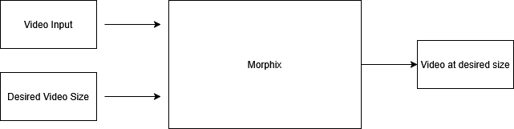

# morphix-prototype
A prototype for Morphix, a universal file conversion and compression desktop application, meant to make both conversion and compression an easy, one-button job for images, videos and audio files.



# Setup
First, make sure you have your virtual environment setup.

Create the virtual environment locally, selecting `[y]` for every option, then verify it exists.
This step installs a bunch of dependencies by default, which cover what need to be installed to run morphix as it is currently.

```py
conda create --name env python=3.13.9
conda info --envs
```

Activate the environment:
```py
conda activate env
```

Change python version, if you wish:
```py
conda uninstall python
conda install python=3.13.9
```

Deactivate then delete the venv
```
conda activate
conda remove --name env --all
```

# Example instruction

Python Morphix.py examples/vid1.mp4 --max-mb 0.5 --output examples/outputs/vid1_new.mp4       
# MSIX Rebuild Notes

Build the EXE:
```bash
py -3 -m PyInstaller --onefile --hidden-import=ffmpeg Morphix.py
```

Dependencies:
```bash
py -3 -m pip install -r requirements.txt
```

Build the COM DLL (outputs to `msix\ContextMenu\`):
```powershell
msbuild .\ContextMenuWrl\MorphixContextMenu.vcxproj /p:Configuration=Release /p:Platform=x64
```

Copy EXE into MSIX payload:
```powershell
copy .\dist\Morphix.exe .\msix\Morphix.exe
```

Pack + Sign (Windows Kits 10.0.26100.0):
```cmd
"C:\Program Files (x86)\Windows Kits\10\bin\10.0.26100.0\x64\makeappx.exe" pack /d "C:\Users\flori\source\repos\morphix-prototype\msix" /p "C:\Users\flori\source\repos\morphix-prototype\Morphix.msix" /nv && "C:\Program Files (x86)\Windows Kits\10\bin\10.0.26100.0\x64\signtool.exe" sign /fd SHA256 /a /f "C:\Users\flori\source\repos\morphix-prototype\Morphix.pfx" /p <YOUR_PASSWORD> "C:\Users\flori\source\repos\morphix-prototype\Morphix.msix"
```

Remove old package + install new:
```powershell
Get-AppxPackage -Name Morphix.Package | Remove-AppxPackage
Add-AppxPackage "C:\Users\flori\source\repos\morphix-prototype\Morphix.msix"
```

# Self-Signed Certificate (MSIX Signing)

Create a self-signed cert in your user store:
```powershell
New-SelfSignedCertificate -Type Custom -Subject "CN=Morphix" -KeyUsage DigitalSignature -FriendlyName "MorphixSignCert" -CertStoreLocation "Cert:\CurrentUser\My" -TextExtension @("2.5.29.37={text}1.3.6.1.5.5.7.3.3", "2.5.29.19={text}")
```

Export it to a PFX:
```powershell
$password = ConvertTo-SecureString -String <YOUR_PASSWORD> -Force -AsPlainText
Export-PfxCertificate -cert "Cert:\CurrentUser\My\<CERT_THUMBPRINT>" -FilePath "C:\Users\flori\source\repos\morphix-prototype\Morphix.pfx" -Password $password
```

Trust the cert (required for Add-AppxPackage on this machine):
```powershell
Export-Certificate -Cert "Cert:\CurrentUser\My\<CERT_THUMBPRINT>" -FilePath "C:\Users\flori\source\repos\morphix-prototype\Morphix.cer"
Import-Certificate -FilePath "C:\Users\flori\source\repos\morphix-prototype\Morphix.cer" -CertStoreLocation "Cert:\LocalMachine\Root"
```

Note: `Publisher="CN=Morphix"` in `msix/AppxManifest.xml` must match the cert subject.
